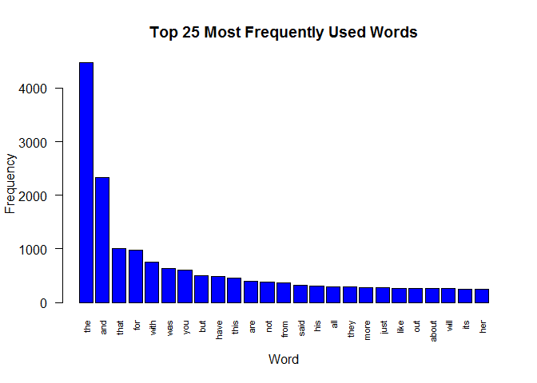
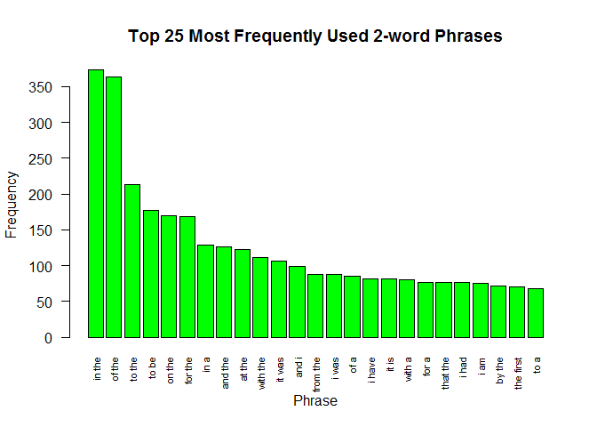
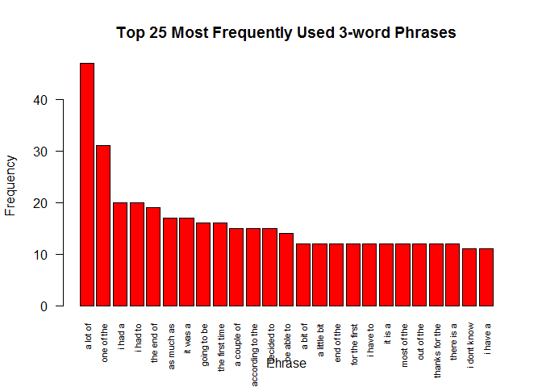

# Data Science Capstone - Milestone Project for NLP
Mike Crabtree  
February 18, 2017  


# Synopsis

Using Natural Language Processing (NLP) to analyze text data can produce powerful insights. The purpose of the course project is to build a model that will predict the next word to follow a previously entered word or sentence segment.  For this milestone project, some exploratory data analysis will be performed on the data to develop a better understanding of the data sufficient to begin work on the final project.  This analysis will show the top 25 most frequently used words, 2-word phrases, and 3-word phrases within the total dataset.

# Setting up the Workspace


```r
setwd("C:/R_Workspace/Capstone_Project")

library(R.utils)
library(stringr)
library(openNLP)
library(tm) 
library(qdap)
library(RWeka)
library(ggplot2)
```

# Data Preprocessing

## Loading the data

For the purpose of this project, only the data from the US will be loaded and analyzed.  The following will load the datasets for blogs, tweets, and news from the United States.


```r
news <- "./en_US.news.txt"
blogs <- "./en_US.blogs.txt" 
twitter <- "./en_US.twitter.txt"
```

## Line Counts

Count the number of lines in each dataset to get a feel for the size of each dataset.  Determining the size of the dataset will give an idea as to how much time some of the analyses will take to run and if samples need to be taken or not.


```r
news_data <- scan(news, character(0), sep = "\n", skipNul = TRUE)
news_lines <- as.numeric(countLines(news))

blogs_data <- scan(blogs, character(0), sep = "\n", skipNul = TRUE)
blogs_lines <- as.numeric(countLines(blogs))

twitter_data <- scan(twitter, character(0), sep = "\n", skipNul = TRUE)
twitter_lines <- as.numeric(countLines(twitter))
```


```
## [1] "The line count for the News data is:  1010242"
```

```
## [1] "The line count for the Blogs data is:  899288"
```

```
## [1] "The line count for the Twitter data is:  2360148"
```

## Data Sampling

Each of the datasets is quite large, and takes almost 30 seconds to load up using 4 cores on Microsoft R Open.  For the purpose of this project, I will be taking a small random sample of each dataset to work with.


```r
news_con <- file("./en_US.news.txt", "r") 
news_sample <-readLines(news_con,
                        (news_lines/1500),encoding= "UTF-16LE")
writeLines(news_sample, con="datanewsa.txt", "\n")
close(news_con)

blogs_con <- file("./en_US.blogs.txt", "r") 
blog_sample <-readLines(blogs_con,
                        (blogs_lines/1500),encoding= "UTF-16LE")
writeLines(blog_sample, con="databloga.txt", "\n")
close(blogs_con)

twitter_con <- file("./en_US.twitter.txt", "r")
twitter_sample <- readLines(twitter_con,
                            (twitter_lines/1500),encoding= "UTF-16LE")
writeLines(twitter_sample, con="datatwa.txt", "\n")
close(twitter_con)
```

## Data Merge

Rather than analyze each of the datasets individually, it can be less complicated to merge them all together and analyze them as a whole.  Now, merge all of the data samples into one file for easy processing and as an initial step to the formation of the corpus.


```r
data_all <- paste(blog_sample,news_sample,twitter_sample)  
data_all <- sent_detect(data_all, language = "en", model = NULL)
```

## Corpus

Form the corpus as a volatile corpus from all of the merged data.


```r
corpus <- VCorpus(VectorSource(data_all))
```

## Data Cleaning

The corpus is the raw data which contains many abnormalities and differences making it difficult to process effectively.  To clean the data the following will be performed:

* Convert all characters to lower-case
* Remove all punctiation symbols
* Remove all numbers
* Remove all leading/trailing whitespace
* Remove URLs


```r
corpus <- tm_map(corpus, content_transformer(tolower)) 
corpus <- tm_map(corpus, content_transformer(removePunctuation))
corpus <- tm_map(corpus, content_transformer(removeNumbers))
corpus <- tm_map(corpus, content_transformer(stripWhitespace))

url_fun <- function(x){
  gsub("http[[:alnum:]]*", "", x)  
}
corpus <- tm_map(corpus, content_transformer(url_fun))
```


## Profanity Filtering

While I generally prefer to see the unfiltered raw data, the assignment requires that the data have profanity removed.

Read in a file of "bad words" given by Carnegie Mellon University found [here](http://www.cs.cmu.edu/~biglou/resources/bad-words.txt).  I found it interesting that many of the "bad words" are not bad at all, but are perhaps followed by derogatory speech.  What qualifies a candidate word for this list is also subjective.


```r
profanity <- readLines("./bad-words.txt")
```

Use the file of "bad words" such that each word is matched and then removed from the corpus.


```r
corpus <- tm_map(corpus, removeWords, profanity) 
```

## n-grams Tokenization

Use RWeka to form the n-gram tokenizers to grab single words, 2-word phrases, and 3-word phrases from within the corpus.


```r
onegram <- function(x) {
  NGramTokenizer(x, Weka_control(min = 1, max = 1))
}
bigram <- function(x) {
  NGramTokenizer(x, Weka_control(min = 2, max = 2))
}
trigram <- function(x) {
  NGramTokenizer(x, Weka_control(min = 3, max = 3))
}
```

# Exploratory Analysis

Using each n-gram tokenizer, form a document term matrix that then can facilitate colsums much like a data frame for the purpose of analysis.


```r
doc_onegram <- DocumentTermMatrix(corpus
                                  ,control=list(tokenize=onegram))
doc_bigram  <- DocumentTermMatrix(corpus
                                  ,control=list(tokenize=bigram))
doc_trigram <- DocumentTermMatrix(corpus
                                  ,control=list(tokenize=trigram))

onegram_sort <- sort(colSums(as.matrix(doc_onegram))
                            ,decreasing=TRUE)
bigram_sort <- sort(colSums(as.matrix(doc_bigram))
                            ,decreasing=TRUE)
trigram_sort <- sort(colSums(as.matrix(doc_trigram))
                            ,decreasing=TRUE)
```

## Plots of The Most Frequently Used Words and Phrases


```r
barplot(onegram_sort[1:25],
        ylab='Frequency',
        xlab='Word',
        main='Top 25 Most Frequently Used Words',
        names.arg=names(onegram_sort)[1:25],        
        col="blue", las=2, cex.names=.7)
```

<!-- -->


```r
barplot(bigram_sort[1:25],
        ylab='Frequency',
        xlab='Phrase',
        main='Top 25 Most Frequently Used 2-word Phrases',
        names.arg=names(bigram_sort)[1:25],        
        col="green", las=2, cex.names=.7)
```

<!-- -->


```r
barplot(trigram_sort[1:25],
        ylab='Frequency',
        xlab='Phrase',
        main='Top 25 Most Frequently Used 3-word Phrases',
        names.arg=names(trigram_sort)[1:25],        
        col="red", las=2, cex.names=.7)
```

<!-- -->

# Conclusion

Many of the most commonly used words and phrases are those that, not surprisingly, frequently join ideas in casual conversation.  One thing I found interesting is that one of the most frequently used 3-word phrases from the sample corpus is "i dont know".

Plans for the predictive algorithm:

* use the n-gram information as input to anticipate which words follow what words/phrases
* use model comparison to see how they differ with predictive power and word choices

Plans for the shiny application:

* create a shiny application based on the models
* plan to allow the user to select between the different individual datasets
* plan to allow the user to maybe select between different models
* consider larger phrases
